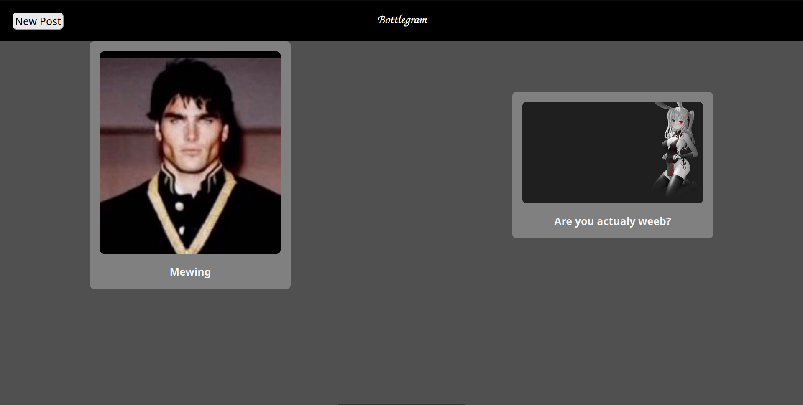
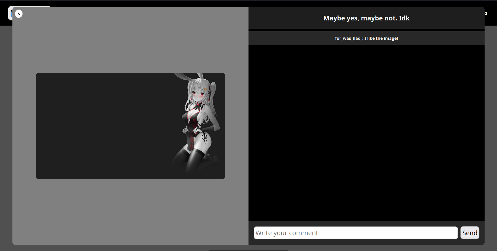
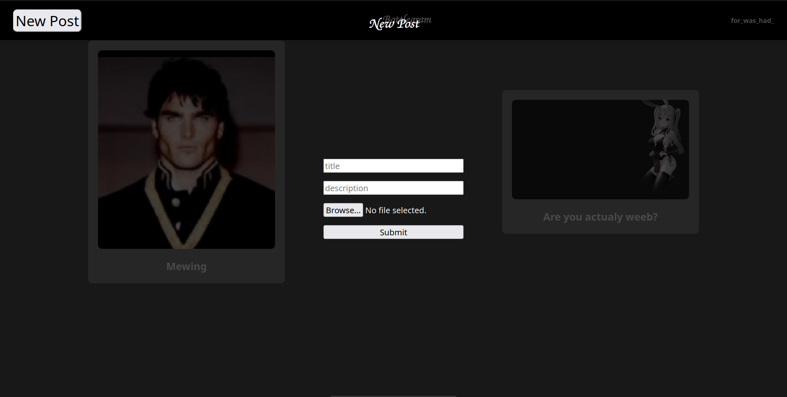

## Bottlegram

Free "social media" platform without any accounts\
The UI may not be that cool but it's free and open source

## Why I made this
I made this app because I wanted to make a platform\
that doesnt require you to make accounts and shit like this

I wanted to create an app that is 100% free and anyone can use without restrictions

## Technologies
It uses python with flask on the server side\
And svelte at the frontend side

As database it uses sqlite3

For generating random usernames it uses [this library](https://www.npmjs.com/package/random-words?activeTab=readme) 

## Some Pictures of the app

Main Page with posts


An example of post


Make new post page


## How to start it

First of all we need an server\
Now the app is working only on localhost but I'll fix it in near future

To start a server type:
```
cd server
pip3 install flask flask_cors
flask run
```

After we started the server we need a client to interact with that server
```
cd client
npm install
npm run dev
```

I know I can build the client but I'll do it later

